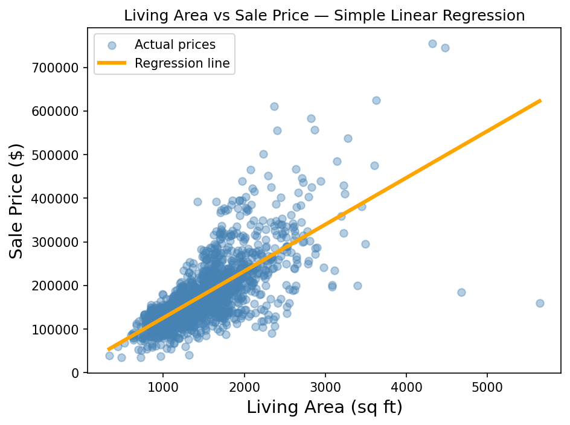

# house-price-predictor
Simple Linear Regression on Kaggle House Prices dataset using Python, Statsmodels and Matplotlib
# House Price Predictor — Simple Linear Regression

## What this project does
Predicts house sale prices using Simple Linear Regression 
applied to the Kaggle House Prices dataset (1,460 houses).

## Concepts demonstrated
- Correlation analysis with heatmap
- Geometrical representation of linear regression
- OLS (Ordinary Least Squares) with Statsmodels
- Interpreting β₀ (intercept) and β₁ (slope)
- Regression line visualization

## Key findings
- Living area has the strongest correlation with price (0.71)
- Every 1 sq ft increase adds approximately $107 to the price
- Bedrooms alone have almost zero correlation (-0.07) — counterintuitive

## Tools used
Python, Pandas, NumPy, Statsmodels, Matplotlib, Seaborn

## How to run
pip install pandas numpy matplotlib seaborn statsmodels
jupyter notebook notebooks/house_price_analysis.ipynb

## Visualization

## Version 2 — Multiple Linear Regression

| Model | Variables | R² |
|-------|-----------|-----|
| Simple Linear Regression | 1 (Area only) | 0.50 |
| Multiple Linear Regression | 4 + Neighborhood | 0.76 |

**Improvement: +25.8% more variability explained**

